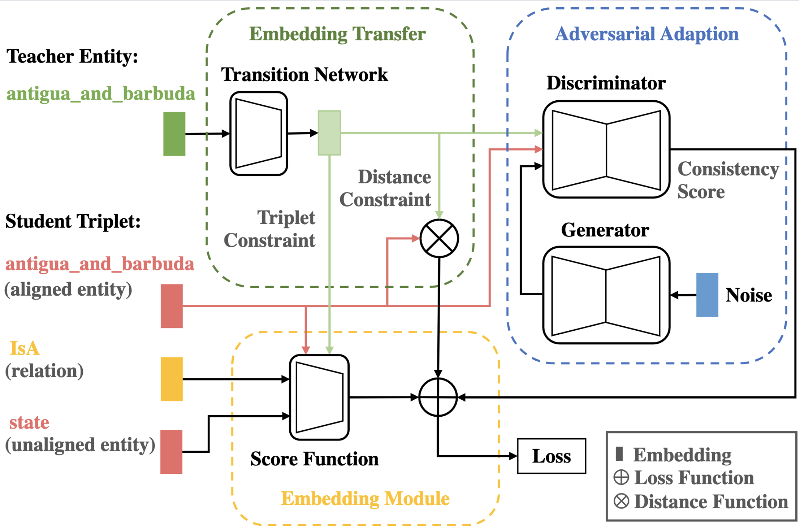

<h2 align="center">An Adversarial Transfer Network for Knowledge Representation Learning</h2>
<p align="center">
  <a href="https://www2021.thewebconf.org/"></a>
  <a href="https://github.com/LemonNoel/ATransN/blob/master/LICENSE">
    
  </a>
</p>

<h2 align="center">

</h2>

Given a target knowledge graph, **ATransN** improves knowledge representation learning by transferring knowledge from one or more teacher knowledge graphs to the target one through an aligned entity set without explicit data leakage. To handle the problem of possible distribution differences between teacher and target knowledge graphs, we introduce an adversarial adaption module. Please refer to the paper for details. 


## Dependencies

- Python 3.x
- PyTorch 1.7

## Dataset

All datasets are included in the `data` directory.

- CN3l (EN-DE)
- WK3l-15k (EN-FR)
- DWY100k 

**Hint**
- `CN3l_EN` merges `CN3l_EN_D` and `CN3l_EN_F`
- `WK3l-15k_EN` merges `WK3l-15k_EN_D` and `WK3l-15k_EN_F`
- `DBP_DB` merges `DBP_DB_W` and `DBP_DB_Y`

- `cn3l_en_d_de_aligned_entity_id.txt` corresponds to (`CN3l_EN_D`, `CN3l_DE`)
- `cn3l_en_de_aligned_entity_id.txt` corresponds to (`CN3l_EN`, `CN3l_DE`)

## Training model

- TransE model

```shell
python run_kge.py --seed 2020 --steps 10000 --eval_steps 2000 --save_steps 2000 --data_path ../data/CN3l_DE --save_path ../dumps --num_workers 0 --margin 8.0 --kge_model TransE --emb_dim 200 --test_batch 512 --kge_batch 128 --num_neg_samples 128 --gpu_id 0;
```

- DistMult model

```shell
python run_kge.py --seed 2020 --steps 10000 --eval_steps 2000 --save_steps 2000 --data_path ../data/CN3l_DE --save_path ../dumps --num_workers 0 --margin 1.0 --kge_model DistMult --emb_dim 200 --test_batch 512 --kge_batch 128 --num_neg_samples 128 --gpu_id 1;
```

- ComplEx model

```shell
python run_kge.py --seed 2020 --steps 10000 --eval_steps 2000 --save_steps 2000 --data_path ../data/CN3l_DE --save_path ../dumps --num_workers 0 --margin 1.0 --kge_model ComplEx --emb_dim 100 --test_batch 512 --kge_batch 128 --num_neg_samples 128 --gpu_id 2;
```

- RotatE model

```shell
python run_kge.py --seed 2020 --steps 10000 --eval_steps 2000 --save_steps 2000 --data_path ../data/CN3l_DE --save_path ../dumps --num_workers 0 --margin 8.0 --kge_model RotatE --emb_dim 100 --test_batch 512 --kge_batch 128 --num_neg_samples 128 --gpu_id 3;
```

- ATransN model

```shell
python run_wgan_kge.py --seed 2020 --steps 10000 --eval_steps 2000 --save_steps 100000 --save_path ../dumps --teacher_data_path ../data/CN3l_EN_D --student_data_path ../data/CN3l_DE --shared_entity_path ../data/SHARED/cn3l_en_d_de_aligned_entity_id.txt --teacher_model_path ../dumps/TransE_CN3l_EN_D_KLR0.0010_ED200_MG8_NS128_SD2020_2020_09_21_15_47_52/ --num_workers 0 --margin 8.0 --kge_model TransE --emb_dim 200 --test_batch 512 --kge_batch 128 --num_neg_samples 128 --kge_alpha 0.0 --kge_beta 0.8 --gpu_id 0;
```

- CTransN model

Uncomment `line 362, 398` in run_wgan_kge.py and comment `line 363, 399` in run_wgan_kge.py

```shell
python run_wgan_kge.py --seed 2020 --steps 10000 --eval_steps 2000 --save_steps 100000 --save_path ../dumps --teacher_data_path ../data/CN3l_EN_D --student_data_path ../data/CN3l_DE --shared_entity_path ../data/SHARED/cn3l_en_d_de_aligned_entity_id.txt --teacher_model_path ../dumps/TransE_CN3l_EN_D_KLR0.0010_ED200_MG8_NS128_SD2020_2020_09_21_15_47_52/ --num_workers 0 --margin 8.0 --kge_model TransE --emb_dim 200 --test_batch 512 --kge_batch 128 --num_neg_samples 128 --kge_alpha 1.0 --kge_beta 1.0 --gpu_id 0;
```

## Citation
Please cite the following paper if you use this code in your work.
```bibtex
@inproceedings{
    wang2021atransn,
    title={An Adversarial Transfer Network for Knowledge Representation Learning},
    author={Huijuan Wang and Shuangyin Li and Rong Pan},
    booktitle={The Web Conference},
    year={2021}
}
```

